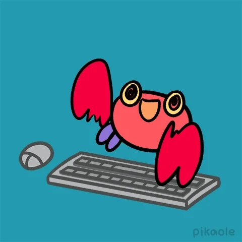

<h1 align="center">Hi 👋, my name is : Arup Sankar Reang</h1>
Welcome to my GitHub profile! I'm Arup , and I'm passionate about machine learning and web development  
Here you'll find a collection of my projects and contributions.

  

  

## About Me
- 🌱 I'm currently working on being better at making deep learning models.
- 💼 I'm currently studying as a student.
- 🔭 I'm interested in discovering new technologies.
- 💻 I do competetive programing on the week ends.
  
 

## Skills

- Programming Languages: [java, python, html,css,mySQL]
- Tools & Technologies: [git,gthub,vs Code,]
- Other Skills: [experience with rasberry pi pico and arduino]

## Projects

Here are a few noteworthy projects I've worked on:

- [Algorac]: a small website made for the university coding club.
- [resnet flower classification]: using resent50v2 to train a flower classification model.
- [my room]: a python game made using pygmae, the game is a collection of small games come in the genre of causal lofi games
- [time series forecasting]: co2 level prediction and BTC/USD market prediction models

Feel free to explore my repositories for more projects and code samples.

## Get in Touch

I'm always open to interesting conversations and collaboration opportunities. You can reach out to me via:

- Email: [arupsankarreang@gmial.com]
- LinkedIn: [(https://www.linkedin.com/in/arup-sankar-reang-b1a902296/)]

Don't hesitate to get in touch if you have any questions or just want to say hi! 😄
<!-- Add any additional sections or information you'd like to include -->

